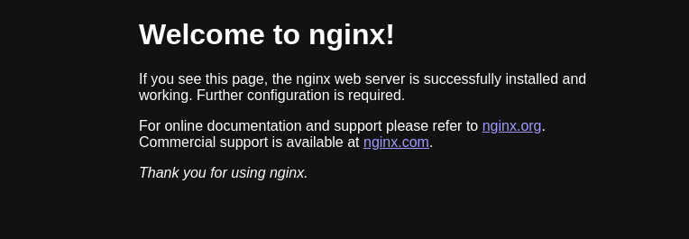

# Skupper demo 101

This repo contains the basic setup to run a quick demo of how Red Hat Service Interconnect (based on project [skupper.io](skupper.io)) works.

I provided the content to replicate three use cases:

- OCP Cluster to OCP Cluster communication
- Podman to k8s/OCP Cluster communication
- VM service to OCP Cluster communication

#### What you need to run the demo

- An OCP Cluster (two, if you want to test cluster to cluster communication), we will call them **cluster-A** and **cluster-B**
- A VM running podman
- 10 minutes of your time

## Preliminary steps

Install the Skupper operator on (each) OCP Cluster by running:

_*on cluster-A*_:

    oc login -u OCP_USERNAME -p OCP_PASSWORD https://OCP_API_URL_CLUSTER_A:6443
    oc apply -f resources/cluster-A/skupper-project.yml -f resources/cluster-A/skupper-operator-subscription.yml

_*on cluster-B*_:

    oc login -u OCP_USERNAME -p OCP_PASSWORD https://OCP_API_URL_CLUSTER_B:6443
    oc apply -f resources/cluster-B/skupper-project.yml -f resources/cluster-B/skupper-operator-subscription.yml

We will use the Red Hat Service Interconnect operator to handle our resources and the console.

## Use case 1: Podman to k8s/OCP Cluster communication

In this use case, we are going to expose a simple golang application that is showing the hostname where it is running.
At the end of the demo, we will see that the application is accessed using an OCP Route, but it is actually served by the **container running in our VM**.

For this section, we are going to use **cluster-A**.

### Skupper initialization on OCP cluster-A

The needed steps to start operating Skupper on the cluster are:

- Initializing the site
- Generate the secret with link configuration
- Retrieve the secret's content to proceed on Podman site

---

#### Site initialization

We start bycreating the site for cluster-A:

```shell
    oc apply -f resources/cluster-A/skupper-site-config.yml
```

The site is configured to also expose the Red Hat Service Interconnect console, with credentials **admin/redhat** that you can use to visualize the connections.

#### Generate the secret with link configuration

We then generate the required secret for site-to-site link configuration:

```shell
    oc apply -f resources/cluster-A/skupper-site-link.yml
```

#### Retrieve the secret's content to proceed on Podman site

Proceed retrievieng the secret and we will use it to create the link with the Podman site we created before:

```shell
    oc get secret -o yaml redhat-site-link-cluster-A > token-cluster-A.yml
```

### Skupper initialization on the VM

On the VM, we will proceed by:

- Initializing the Podman site
- Establish the link with the OCP site

---

#### Initializing the Podman site

Let's start initializing Skupper on the VM:

```shell
    skupper init --ingress none --platform podman
```

#### Establish the link with the OCP site

And finally we establish the link between the two sites:

```shell
    skupper link create --name ocp-link token-cluster-A.yml --platform podman
```

### Workload creation and configuration

We will get a confirmation that the link is up and running:

```shell
    [sysadmin@rhel9-vm ~]$ skupper link status
    Links created from this site:
            Link ocp-link is connected
```

Now we can start our container, we will use a standard _nginx_

```shell
podman run --name nginx -d --network skupper -p docker.io/nginx
```

```shell
skupper expose host nginx --address podman-nginx --port 8080 --target-port 80 --platform podman
skupper service create podman-nginx 8080 --platform kubernetes
```

```shell
oc expose svc/podman-nginx
```

route.route.openshift.io/podman-nginx exposed

If you now navigate to [http://hello-skupper-skupper-demo.apps.OCP_DOMAIN/](http://hello-skupper-skupper-demo.apps.OCP_DOMAIN/) you should be able to access the nginx instance created on the VM with Podman:



OCP:
oc delete route podman-nginx
skupper service delete podman-nginx --platform kubernetes

VM:
podman rm -f nginx
skupper service delete podman-nginx --platform podman
skupper link delete ocp-link --platform podman

## VM service to k8s/OCP Cluster communication

On the VM:
oc login -u OCP_USERNAME -p OCP_PASSWORD https://OCP_API_URL:6443
oc apply -f skupper-project.yml
oc project skupper-demo

skupper init --ingress none
skupper gateway init --type podman

skupper service create hello-skupper 8080
skupper gateway bind hello-skupper localhost 8080 --platform kubernetes
oc expose svc hello-skupper

./hello-skupper/hello-skupper

curl http://hello-skupper-skupper-demo.apps.OCP_DOMAIN/

If everything is correctly configured, you'll see the following, confirming we are accessing our local application from OCP:


### Cleanup

skupper service delete hello-skupper --platform kubernetes
skupper gateway delete --platform kubernetes
