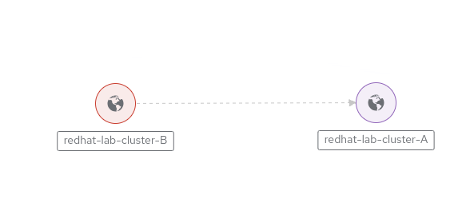

## Use case 3: OCP Cluster to OCP Cluster communication

In the last use case, we will see how easy it is to link two clusters running Skupper/Red Hat Service Interconnect.

Leveraging the context creation we set up before, we will be able to easily issue all commands from a single terminal.

For our use case, we will deploy an application on _cluster A_ and we will expose it to the outside world on _cluster B_, our public cluster.

Since we need to expose the application from _cluster A_ and reach the application from _cluster B_, we will create the link unidirectionally from \*\*cluster B --> cluster A".

---

### Skupper site configuration on clusters

The first thing we need to do is configuring the site on cluster A:

```shell
    oc apply -f resources/cluster-A/skupper-site-config.yml --context cluster-A
```

Followed by the same activity on cluster B:

```shell
    oc apply -f resources/cluster-B/skupper-site-config.yml --context cluster-B
```

On cluster A, we will then issue the creation of the link configuration in a secret (_redhat-site-link_):

```shell
    oc apply -f resources/cluster-A/skupper-site-link-config.yml --context cluster-A
```

In order to establish the link, we will then fetch the configuration from the freshly created secret and apply it to cluster B:

```shell
    oc get secret -n skupper-demo redhat-site-link -o yaml --context cluster-A | oc apply -f - --context cluster-B
```

Since we created the link unidirectionally, we can verify that the link is up only from cluster B to cluster A:

```shell

skupper link status --context cluster-B

Links created from this site:

         Link redhat-site-link is connected

 skupper link status --context cluster-A

Links created from this site:

         Link redhat-site-link **not** connected
```

On OCP, if you go in the Skupper console (https://skupper-skupper-demo.apps.CLUSTER*DOMAIN/) and log in with \_admin/redhat\* credentials, you can confirm the link is up:



---

### Workload generation

Since we want to deploy our application on cluster A, we can use the deployment resources in the [resources folder](./resources/cluster-A/):

````shell
oc apply -f resources/cluster-A/skupper-deployment.yml --context cluster-A
```

Then we are going to create the service on cluster A:

```shell
oc expose deployment hello-skupper --context cluster-A --port 8080
````

And finally we want to check if the application is working, so we create a route/ingress to check if all is fine:

```shell
oc expose service hello-skupper --context cluster-A
```

If everything is working, we will see that the application is serving requests from cluster A, in the deployed pod:


We can now let Skupper do the magic, and we can use the **skupper expose** command to generate the linked service on cluster B:

```shell
skupper expose deployment/hello-skupper --port 8080 --context cluster-A
```

```shell
oc get service hello-skupper --context cluster-B

|               |           |              |             |          |     |
| ------------- | --------- | ------------ | ----------- | -------- | --- |
| NAME          | TYPE      | CLUSTER-IP   | EXTERNAL-IP | PORT(S)  | AGE |
| hello-skupper | ClusterIP | 10.217.4.176 | <none>      | 8080/TCP | 13s |
```

Then we proceed exposing the route on cluster B and test our application:

```shell
oc expose service hello-skupper --context cluster-B
```

As you can see, the output is exactly the same, because the application served by cluster B is deployed on cluster A!


### Cleanup

To cleanup, run the following commands:

```shell
oc delete route,deployment,service hello-skupper --context cluster-A
skupper link delete redhat-site-link --context cluster-A
skupper link delete redhat-site-link --context cluster-B
skupper service delete hello-skupper --context cluster-A
skupper service delete hello-skupper --context cluster-B
skupper delete --context cluster-A
skupper delete --context cluster-B
```
